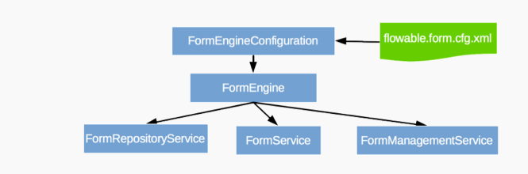

------


## 一、 flowable服务架构

- ​    架构：

　

-  实例化方式：

```
FormEngine formEngine = FormEngines.getDefaultFormEngine();
FormRuleService formRuleService = formEngine.getFormRuleService();
FormRepositoryService formRepositoryService = formEngine.getFormRepositoryService();
FormService formService = formEngine.getFormService();
FormManagementService formManagementService = formEngine.getFormManagementService();
```


## 二、数据库表

在应用重启时数据库中会增加act_fo_为前缀的六张数据库表格：


```
`act_fo_databasechangelog`: Liquibase用来跟踪数据库变量的
`act_fo_databasechangeloglock`: Liquibase用来保证同一时刻只有一个Liquibase实例在运行
`act_fo_form_definition`:存储表单定义的信息
`act_fo_form_instance`:存储用户填充后表单实例信息
`act_fo_form_deployment`:存储表单部署元数据
`act_fo_form_resource`:存储表单定义的资源
```

## 三、表单定义

- 表单定义文件是以.form为后缀， 内容格式为Json格式。如下示例所示：

```json
{
    "key": "form1",
    "name": "My first form",
    "fields": [
        {
            "id": "input1",
            "name": "Input1",
            "type": "text",
            "required": false,
            "placeholder": "empty"
        }
    ],
    "outcomes": [
        {
            "id": "null",
            "name": "Accept"
        },
        {
            "id": "null",
            "name": "Reject"
        }
    ]
}
```

- 字段解析：

```
key：属性是其唯一性标识，表单引擎可以通过该key获取到它， 同时数据库对相同key会维护不同的版本。

fields：数组

outcomes：表单结果。

id：在同一个表单定义文件中必须唯一，当用户赋值时它会作为变量的名称。每一个表单字段都有id,name和type属性。

在上例中，也就是会创建名称为input1的变量，值由用户填入。同时表单结果也会以`form_<form-identifier>_outcome`获取得到，对于上例，用户选择的结果会赋值给`form_form1_outcome`， 我们可以通过`${form_form1_outcome == "Accept"}`表达式来验证表单结果是否为Accept。
type：属性支持text, multi-line-text,integer,boolean,date等多种类型
```

## 四、demo

运行demo查看act_fo_form_instance、act_fo_form_resource表的变化。


